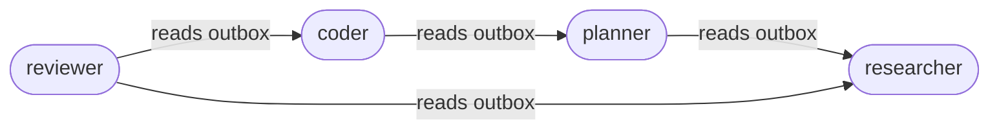

# LeMMing Overview

LeMMing is a filesystem-first multi-agent orchestration engine. Instead of hiding work behind databases or proprietary queues, everything that matters lives as files on disk. Each agent has a folder, a resume, and an outbox. The engine ticks forward on a schedule, letting small workers pass notes and update shared memory. If you can browse directories, you can watch the organization work.

## Why filesystem-first?
- **Transparency:** Resumes, schedules, and messages are plain files you can open, diff, and version-control.
- **Portability:** Copy a folder and you have the entire department—no hidden state.
- **Determinism:** Tick-by-tick execution makes behavior reproducible and debuggable.

Think of it as an **AI company in a folder**: every worker has a desk (its directory), a job description (resume), tools it is allowed to use, and an outbox where it leaves notes for coworkers. The engine walks the floor every tick and asks who is scheduled to work. Notes pile up in outboxes, memory files grow, and logs explain how the shift went.

## What problems it solves
- Quickly prototype multi-agent behaviors without standing up message buses or databases.
- Enforce safety by default: workers can only read outboxes and files they are permitted to access; credits gate their run budget.
- Provide a stable ABI for LLM workers: resumes declare their identity, tools, and schedule; outputs follow a JSON contract so the engine can apply changes and keep going safely.

## Minimal glossary
- **Agent:** A worker persona backed by a directory under `agents/`. Its identity is defined by `resume.json` (and optional `resume.txt`).
- **Resume:** The agent contract. `resume.json` contains the ID card, permissions, schedule, and model. `resume.txt` holds the long-form instructions (their "mind").
- **Outbox:** Per-agent folder of JSON messages. Agents only ever write to their own outbox. Other agents read permitted outboxes to build their virtual inbox.
- **Tick:** One heartbeat of the engine. Scheduling uses `(tick + phase_offset) % run_every_n_ticks == 0` to decide who fires.
- **Tool:** A permission-gated capability (filesystem read/write, shell, memory operations, connectors, etc.).
- **Credits:** Budget that allows an agent to run. Each model call deducts from `credits.json`.
- **Department bundle:** A shareable set of agent folders (resumes + instructions) that can be copied in to recreate a mini-organization.

## Mental model: running an AI org
1. Drop agent folders into `agents/`.
2. Set schedules and permissions in each `resume.json`.
3. Start the engine (`python -m lemming.cli run` or `serve`). The tick counter advances and scheduled agents execute.
4. Watch outputs accumulate in `agents/<name>/outbox/`, memories under `agents/<name>/memory/`, and logs under `logs/<name>/`.

### Org wiring diagram (permissions as edges)


### Tick loop at a glance
```mermaid
flowchart TD
    A[Start tick] --> B[Discover agents]
    B --> C[Filter by schedule]
    C --> D[Build prompt (resume + memory + readable outboxes)]
    D --> E[Call model]
    E --> F[Parse JSON contract]
    F --> G[Write outbox entries]
    F --> H[Execute tool calls]
    F --> I[Apply memory updates]
    F --> J[Log notes + deduct credits]
    J --> K[Cleanup old outbox entries]
    K --> L[Persist next tick]
```

### Quick example: a tiny org in motion
- Tick 1: `planner` fires, reads nothing yet, and posts a task to its outbox.
- Tick 2: `researcher` fires, reads `planner`'s outbox, saves findings to its own outbox and memory.
- Tick 3: `coder` fires, reads both outboxes, writes code via the file tools, and leaves status notes.
- Tick 4: `reviewer` fires, reads coder output, and posts review notes.

You can open the folders at any point to see the organization’s state—no dashboards required (though there is one).
