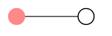

# Scheduling

LeMMing runs on a tick-based rhythm. Every tick is a heartbeat where the engine decides which agents fire. The rules are deterministic so you can replay and predict behavior.

## Firing rule
For an agent with schedule `{run_every_n_ticks: N, phase_offset: P}`:
```
should_fire = (tick + (P % N)) % N == 0
```
- `N` must be > 0.
- `P` can be any integer (positive or negative); it shifts the phase.

## Fire point
A derived value used only for ordering agents within the same tick:
```
fire_point = ((-phase_offset % N) / N)  // in [0, 1)
```
Lower `fire_point` runs earlier. If two agents share the same `fire_point`, they are ordered alphabetically by canonical `agent_name`.

Deterministic order = `sort by (fire_point, agent_name)`.

## Visual metaphor: the clock circle
Imagine each agent placed on a circle divided into `N` slots.
- The **red rim** is the sweep of time within a tick window.
- The **dot** is the agent’s `fire_point` on that circle.
- The **arc** from the last fire to the next fire is the progress indicator.

```
Clock (N = 4)
      dot
   *   ↑
red rim →
```

A fuller circle view:


In the dashboard, this becomes a sweep animation: the rim turns red as ticks advance; when the sweep hits the agent’s dot, the agent fires.

## Example schedule table
| Agent   | run_every_n_ticks (N) | phase_offset (P) | Fires on ticks | fire_point |
|---------|----------------------|------------------|----------------|------------|
| planner | 2                    | 0                | 0,2,4,6,...    | 0.00       |
| researcher | 3                 | 1                | 2,5,8,11,...   | 0.67       |
| coder   | 1                    | 0                | every tick     | 0.00       |

Within a tick, ordering is determined by the `(fire_point, agent_name)` pair: `coder` (0.00, coder) runs before `planner` (0.00, planner) because alphabetical tie-breaker.

## How it shows up in the UI
- Agents that will fire this tick are highlighted; their rim segment is almost complete.
- Agents with no credits appear “starved” (greyed out) even if their dot is hit.
- If an upstream agent has not produced an outbox entry before a downstream agent’s fire point, the UI can flag a potential bottleneck.
