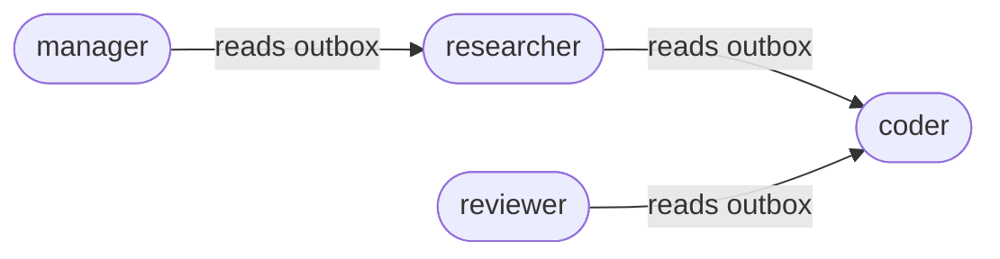

# UI Vision

LeMMing ships with a dashboard, but the long-term vision is a blank whiteboard where you can see your AI organization move in real time. The UI should be friendly for non-technical users while exposing exact details for builders.

## Main canvas
- **Agent nodes** are circles or icons placed on a canvas. Size and color convey state (idle/running/starved/out-of-credits).
- **Edges** show who reads whose outbox. If `A` can read `B`, draw an arrow `A ← B`.
- **Org timer circle** sits in the corner: a red rim sweeps around the circle to represent tick progress. Each agent has a dot on the rim at its `fire_point`; the dot pings when the agent fires.

### Org wiring example

## Node states
- **Idle** – Waiting for its fire point; neutral color.
- **Running** – Firing this tick; highlighted with a glow.
- **Starved** – Scheduled but blocked (no credits); greyed out with a coin icon.
- **Out-of-credits** – Explicit “empty wallet” indicator; clicking opens the credit top-up prompt.

## Always-visible baseball card
When a node is selected, show a side panel that always stays visible:
- Name, title, short description
- Model picker (from `models.json`), temperature slider (where supported)
- “Intelligence” and “creativity” sliders mapped to provider-safe defaults
- Schedule diagram (mini clock showing `run_every_n_ticks` and `phase_offset`)
- Tool list with toggles; file access allowlists displayed as readable paths
- Inbound sources (read_outboxes) and outbound send restrictions (if configured)
- Current credits and cost-per-action

## Org timer circle & bottlenecks
- The red rim sweeps once per tick (duration = `org_config.base_turn_seconds`).
- The selected agent’s dot is highlighted; when the rim reaches the dot, a ping animation shows the fire.
- If an upstream agent has not produced an outbox entry before a downstream agent’s fire point, show a subtle warning (e.g., yellow halo) to indicate a possible dependency bottleneck.

## Messaging view
- Timeline of outbox entries per agent (newest first), with tags and recipients.
- Clicking an entry opens the JSON payload plus a humanized summary.
- Preserve unknown message kinds/fields to maintain timeline integrity; the UI must not strip or reorder fields it does not understand.

## Tool management
- Treat “connectors” as tools in the product language. A “Tool Store” lists available tools/connectors with descriptions.
- Per-agent toggles to enable tools; configuration drawers for common ones (filesystem allow_read/allow_write paths, web access, future connectors).
- Safe defaults: no tools enabled means the agent cannot touch the filesystem or shell; older engines ignore unknown tool fields while preserving them for forward compatibility.

## "+ Add Agent" flow
- Starts from the canvas with a floating "+" button.
- Options: choose a template (e.g., planner/researcher/coder trio), import an existing `resume.json`/`resume.txt`, or pick from a future marketplace.
- Preview shows the schedule dot on the org timer circle and the default permissions the template will request.

## Language choices
- Prefer “memory” and “notes” instead of “context window.”
- Keep exact details in expandable “Advanced” panels so non-technical users are not overwhelmed.

## URLs and navigation (current)
- Dashboard: `/dashboard`
- API docs: `/docs`
- WebSocket feed: `/ws`

The UI should make the filesystem state legible without forcing users to read JSON files, while staying true to the engine’s deterministic, file-backed model.
